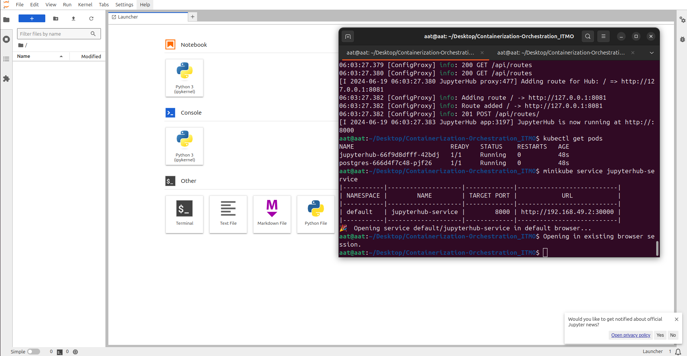

# Описание задачи

Развернуть свой собственный сервис в Kubernetes, по аналогии с ЛР 3

## jupyterhub + PostgreSQL
Запускаем Minikube
```
minikube start
```

Сборка и загрузка Docker образа в Minikube
```
eval $(minikube docker-env)
docker build -t custom-jupyterhub:latest .
```

Для разворачивания
```
kubectl create -f pg_secret.yml
kubectl create -f pg_configmap.yml
kubectl create -f pg_service.yml
kubectl create -f pg_deployment.yml

kubectl create -f jupyterhub.yml
```
Проверяем
```
minikube service jupyterhub-service
```

