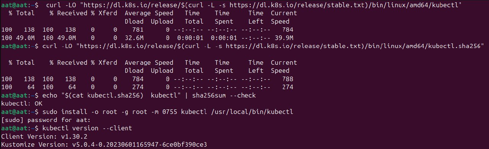

# Описание задачи

Развернуть свой собственный сервис в Kubernetes, по аналогии с ЛР 3

## jupyterhub + PostgreSQL
Сборка и загрузка Docker образа в Minikube
```
eval $(minikube docker-env)
docker build -t custom-jupyterhub:latest .
```

Для разворачивания
```
kubectl apply -f postgres-secret.yaml
kubectl apply -f postgres-configmap.yaml
kubectl apply -f postgres-service.yaml
kubectl apply -f postgres-deployment.yaml
kubectl apply -f jupyterhub-configmap.yaml
kubectl apply -f jupyterhub-service.yaml
kubectl apply -f jupyterhub-deployment.yaml

```
Проверяем
```
kubectl version --client
```

