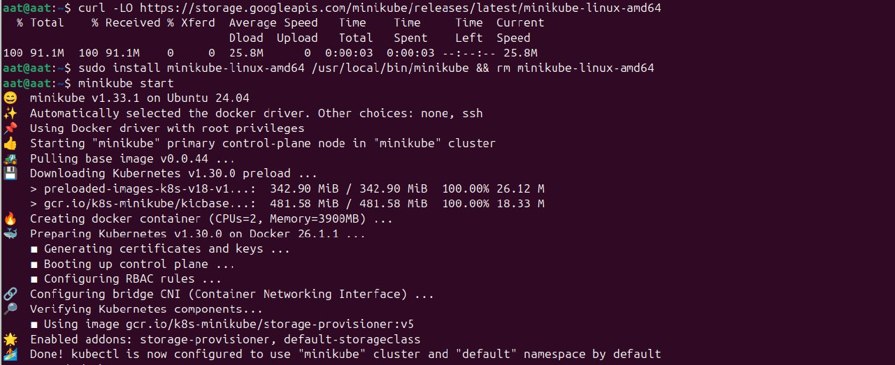
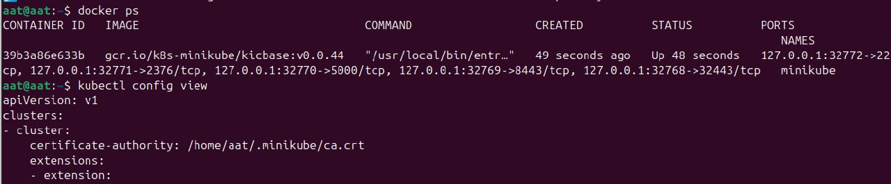
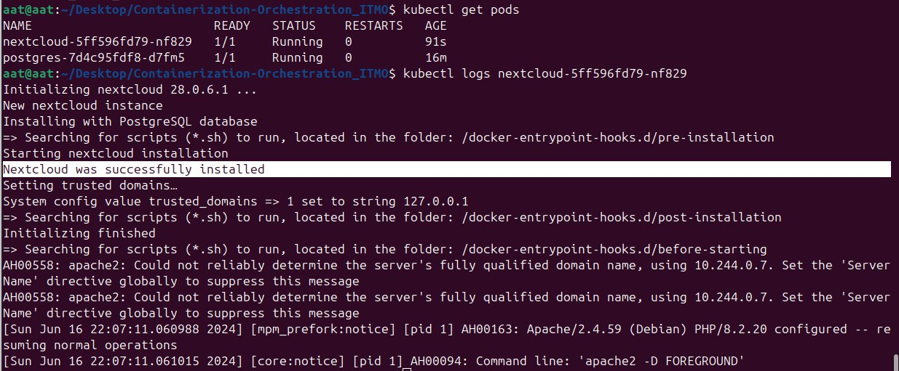
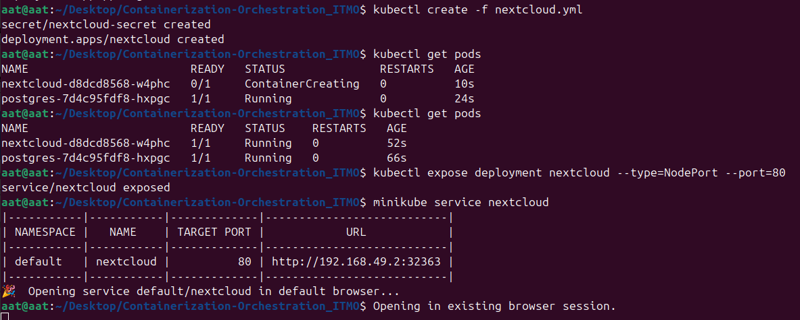
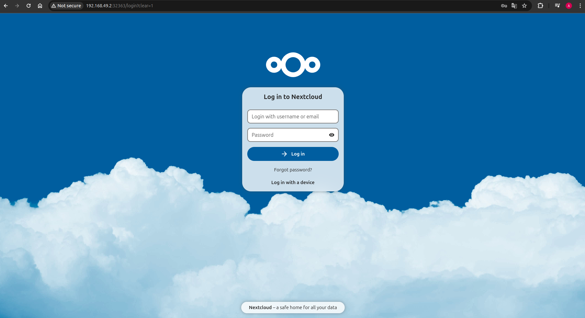
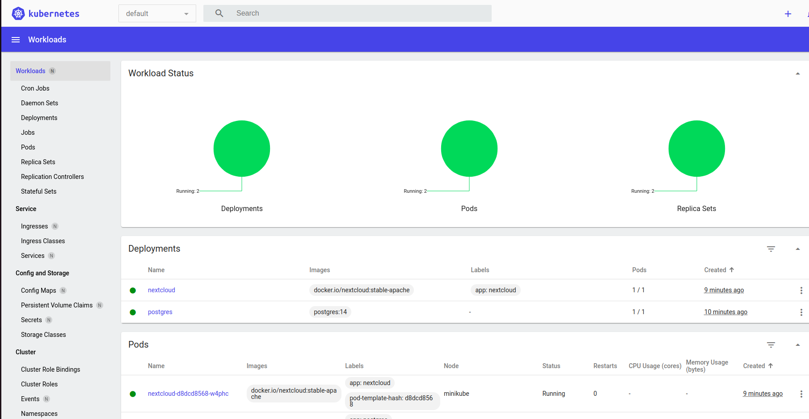

# Описание задачи

Установить Kubernetes на локальную машину. Развернуть тестовый сервис

## kubectl
Для установки
```
curl -LO "https://dl.k8s.io/release/$(curl -L -s https://dl.k8s.io/release/stable.txt)/bin/linux/amd64/kubectl"
curl -LO "https://dl.k8s.io/release/$(curl -L -s https://dl.k8s.io/release/stable.txt)/bin/linux/amd64/kubectl"
sudo install -o root -g root -m 0755 kubectl /usr/local/bin/kubectl
```
Проверяем
```
kubectl version --client
```


## minikube

Для установки
```
curl -LO https://storage.googleapis.com/minikube/releases/latest/minikube-linux-amd64
sudo install minikube-linux-amd64 /usr/local/bin/minikube && rm minikube-linux-amd64
minikube start
```

Проверяем
```
docker ps
kubectl config view
```


## Nextcloud + PostgreSQL
```
kubectl apply -f postgres-secret.yml
kubectl apply -f postgres-configmap.yml
kubectl apply -f postgres-service.yml
kubectl apply -f postgres-deployment.yml

kubectl apply -f nextcloud-secret.yml
kubectl apply -f nextcloud-configmap.yml
kubectl apply -f nextcloud-deployment.yml
```





## Вопросы
1. Важен ли порядок выполнения этих манифестов? Почему?
- Да, важно, как минмиум можно рассмотреть наш случай. Предположим, что мы выполянем deployment перед configmap и мы просто напросто не знаем какие занчения логина, тк обращаемся к пустоте. Кстати, я попал в глупую ловушку когда при копировании закинул код не на свое место и долго не мог понять почему постгря уже есть хотя я ничего не деплоил.

2. Что произойдет, если отскейлить количество реплик postgres-deployment в 0, затем обратно в 1, после чего попробовать снова зайти на Nextcloud?
- Зависает и потом улетает с ошибкой безвозвратно.

  UPD: При отскейле кол-ва обратно к 1, будет создан новый pod с БД и так как не был создан volume, то данные не сохранятся. А изначально при отскейле до 0 не будет доступа к БД.
  
```
Internal Server Error

The server encountered an internal error and was unable to complete your request.
Please contact the server administrator if this error reappears multiple times, please include the technical details below in your report.
More details can be found in the server log.
```
